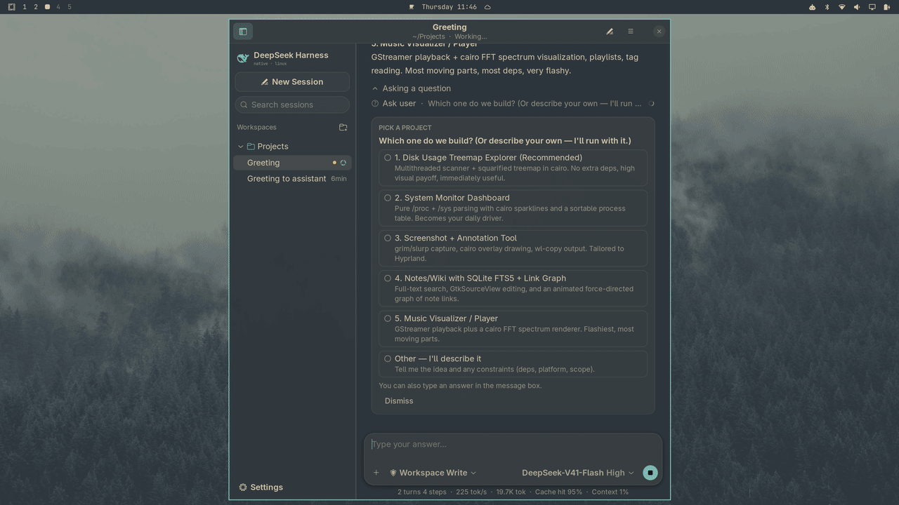
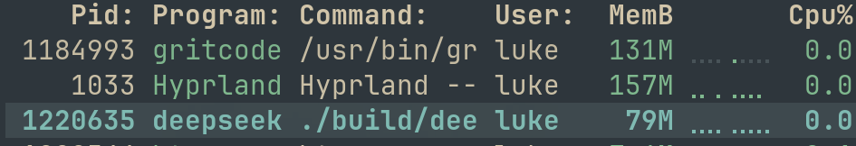

# DeepSeek Native for Linux

A fast, native Linux desktop app for the [DeepSeek Harness](https://github.com/deepseek-ai/deepseek-harness) coding agent, written in C with GTK 3.

DeepSeek ships its Harness desktop app for Windows and macOS only, as an Electron shell around the Harness web UI (Electron 44, plus bundled Node, pnpm and Python, at roughly 300 MB). There's no Linux build. This project brings the agent to Linux as one small native program instead: the agent loop, its tools and the chat UI are reimplemented in C. There's no browser engine, no Node runtime and no bundled Python. It starts fast, idles at 0% CPU and uses less memory than your compositor. It's a Linux port of [deepseek-native](https://github.com/lszl84/deepseek-native), the Swift/AppKit rewrite for macOS, and follows its design closely.

<p align="center">
  
</p>

The app takes its colors from your GTK theme, so it looks at home on any desktop. The screenshots above use [Omagtk](https://github.com/lszl84/omagtk), a GTK3 theme that follows your [Omarchy](https://omarchy.org) theme. Switch Omarchy themes and DeepSeek recolors along with every other GTK3 app, live and without a restart: the window chrome, the composer and the custom-drawn transcript all change together.

> [!NOTE]
> This is an independent project, not affiliated with or endorsed by DeepSeek. It needs your own DeepSeek API key.

## Highlights

- **Fast, native and small.** The stripped binary is about 480 KB. It's one process with no web view, no Electron and no Node runtime, and uses only GTK 3, libcurl, json-glib and libsecret. It starts fast, scrolls smoothly through hundreds of turns, and uses about 80 MB of memory in real use.
- **Same agent as the Harness.** It uses the same DeepSeek Messages API, a system prompt adapted from the Harness, and the same tool names and JSON schemas, so the model behaves the same way.
- **Custom transcript renderer.** A `GtkScrollable` widget draws the conversation with Pango and Cairo, styled after the Harness web UI. It supports Markdown with tables, task lists and syntax-highlighted code, and tool calls fold into collapsible groups. You can select and copy text across the whole conversation. Only visible content is drawn, and only changed items are rebuilt.
- **Landlock sandbox.** In Read Only and Workspace Write modes, shell commands run under a [Landlock](https://docs.kernel.org/userspace-api/landlock.html) ruleset applied between `fork` and `exec`. This needs no root and no extra tools. Blocked writes show up as `Permission denied`, and writes the policy doesn't allow show an inline approval card.
- **Uses your existing Harness setup.** It finds your API key in the keyring, the environment or `~/.dsh`. On first launch it imports your Node Harness sessions from `~/.dsh/sessions`, which needs `zstd` or `node`. To import again later, use the menu → Import DeepSeek Harness Sessions.
- **Fits your desktop.** Colors come from the active GTK theme (background, text and accent), and the app follows the desktop's light or dark preference. With [Omagtk](https://github.com/lszl84/omagtk) on Omarchy, it follows every theme switch live.

## Requirements

- Linux 5.13 or later for the Landlock sandbox. On older kernels, shell commands ask for approval instead.
- GTK 3.24, libcurl, json-glib 1.6 or later, libsecret 0.20 or later, and a C compiler
- A [DeepSeek API key](https://platform.deepseek.com/)
- Optional: `rg` (ripgrep) for fast `glob`/`grep` and `@` file completion. A built-in fallback is used without it.

On Arch Linux and Omarchy:

```sh
sudo pacman -S --needed base-devel gtk3 curl json-glib libsecret ripgrep
```

On Debian and Ubuntu:

```sh
sudo apt install build-essential libgtk-3-dev libcurl4-openssl-dev libjson-glib-dev libsecret-1-dev ripgrep
```

## Build and run

```sh
make                  # release build → build/deepseek-native
./build/deepseek-native
make install          # into ~/.local (binary, .desktop file, icons); PREFIX=/usr/local works too
make test             # sandbox self-test: no network or API key needed
```

`make BUILD=debug` builds with AddressSanitizer and UBSan.

The app looks for an API key in this order. It keeps the key in memory and never writes it to disk.

1. its own keyring entry, set in **Settings → Models** and stored through libsecret
2. the `DEEPSEEK_API_KEY` environment variable
3. `DEEPSEEK_API_KEY` in the Harness credential file `~/.dsh/.credentials.yaml`

`DEEPSEEK_BASE_URL` overrides the endpoint. The default is `https://api.deepseek.com/anthropic`. Commands the agent runs never see `DEEPSEEK_API_KEY` in their environment.

## Features

### Agent

| | |
|---|---|
| API | DeepSeek's Anthropic-compatible Messages API with SSE streaming. Thinking blocks and their signatures are replayed, and prompt caching applies. |
| Models | `deepseek-flash` (DeepSeek-V41-Flash) and `deepseek-v4-pro`, with reasoning effort off, low, high or max. |
| Tools | `bash`, `read`, `write`, `edit`, `read_image`, `glob`, `grep`, `web_search` (DeepSeek native search), `web_fetch`, `todo_write`, `ask_user_question`, `subagent`, `job_list`, `job_output`, `job_kill`, `present` |
| Safety | `read` must come before `write` or `edit` on an existing file. Long output is truncated, with the full text saved to a spill file. A command that times out moves to a background job instead of being killed. |
| Control | Stop cancels the stream and kills the command's whole process group. A message sent while the agent runs is added to its next step. Retryable API errors are retried with backoff. A finished background job wakes the agent with a notice. |
| Context | Once the prompt passes 80% of the context window, older history is summarized automatically. |
| Project instructions | `AGENTS.md` or `CLAUDE.md` in the workspace root, plus custom instructions from Settings |

### Permission modes

| Mode | Shell commands | File tools |
|---|---|---|
| Read Only | Landlock sandbox. Writes are allowed only in temp, cache and runtime directories. | Every write asks for approval. |
| Workspace Write | Landlock sandbox. Writes are also allowed inside the workspace. | Writes outside the workspace ask for approval. |
| Full Access | No sandbox. | No approvals. |

### Interface

- **Sidebar:** workspaces and their sessions, with search, pin, archive, rename and delete. Running sessions show a spinner, and sessions waiting on you show an attention dot. Right-click opens actions such as Open in Files and Open in Terminal.
- **Transcript:** "Took 12s" turn headers and groups such as "Ran commands" or "Wrote files and ran commands". Tool details expand to show command output, diffs, checklists, sources and subagent results. Approval and question cards appear inline, and each turn ends with a footer showing copy, token usage and time. Selecting text also fills the primary selection for middle-click paste.
- **Composer:** Enter sends and Shift+Enter adds a line (configurable). `@` completes workspace files and `/` offers commands. You can attach files by dragging, pasting or the + button, and paste images directly. The permission and model/effort menus sit in the composer.
- **Status line:** turns, steps, tokens per second, total tokens, cache hit rate and context usage.
- **Other:** desktop notifications and an urgency hint when a turn finishes or needs you while the window is in the background, Markdown export, and a keyboard shortcut list (Ctrl+?).

Keyboard shortcuts:

| Shortcut | Action |
|---|---|
| Ctrl+N | New session |
| Ctrl+O | Open workspace |
| Ctrl+. | Stop |
| Ctrl+R | Retry last turn |
| Ctrl+L | Focus message box |
| Ctrl+K | Search sessions |
| Ctrl+Shift+C | Copy last response |
| Ctrl+Shift+E | Export as Markdown |
| F2 | Rename session |
| F9 | Toggle sidebar |
| Ctrl+, | Settings |

## Performance

Here is DeepSeek Native in btop on Omarchy (Hyprland on an i5-8365U laptop) during a real session, next to Hyprland itself and gritcode:

<p align="center">
  
</p>

| | DeepSeek Native (Linux) |
|---|---|
| Memory in real use | ~80 MB RSS |
| CPU at idle, including a waiting turn | ~0% |
| CPU while streaming (~200 tokens/s) | 15–20% of one core, measured under GTK's Broadway backend; transcript rebuilding and drawing take 4–9% |
| Memory with a 300-turn session open | ~75–80 MB RSS |
| Binary (stripped) | ~480 KB |

For comparison, the official desktop app bundles Electron, Node, pnpm and Python into a 290–370 MB download, and a Chromium-based app typically uses several hundred MB of memory across its processes.

## Data

| Path | Contents |
|---|---|
| `~/.local/share/deepseek-native/sessions/*.jsonl` | Append-only session logs, loaded lazily when opened |
| `~/.local/share/deepseek-native/workspaces.json` | Workspace list and session index |
| `~/.local/share/deepseek-native/spill/` | Full outputs of truncated commands and searches |
| `~/.config/deepseek-native/settings.json` | Settings (never contains the API key) |

## How it works

```
src/
├── main.c, app.c           entry point, window, actions, CSS from the GTK palette, test hooks
├── headless.c              terminal driver (--headless)
├── util.c, settings.c      helpers, JSON, main-thread marshaling, settings and API key lookup
├── llm.c                   streaming Messages client (libcurl + SSE)
├── conversation.c          content blocks, messages, wire/storage formats
├── session.c, store.c      session model and JSONL log, workspace and session index
├── agent.c, prompt.c       agent loop, approvals and questions, compaction, system prompt
├── tools.c, presentation.c tool implementations and their display names and summaries
├── process.c, jobs.c       child processes, Landlock sandbox, background jobs
├── theme.c                 palette from the GTK theme, fonts, icons, drawing helpers
├── textlayout.c            attributed text on Pango: selection, links, inline code
├── markdown.c              Markdown parser and syntax highlighter
├── elements.c              element tree for the transcript (text, code, tables, cards, …)
├── builder.c               session → keyed, signed transcript items
├── transcript.c            GtkScrollable canvas: drawing, hit testing, selection
├── composer.c, chat.c      message box, completions, chat view
└── sidebar.c, prefs.c      sidebar and settings window
```

- **Threads.** Each turn runs its agent loop on a worker thread. Network calls, tools and subagents block that thread. Every change to session state happens on the GTK main thread, through `main_sync()`, which works like a small `MainActor.run`. Concurrency-safe tools in the same step (reads, searches, web, subagents) run in parallel threads.
- **Rendering.** `transcript_build()` turns a session into item specs with keys and signatures. An item's elements are built only when its signature changes, and while text streams, finished paragraphs are parsed once and only the live tail is parsed again. The transcript lays items out once per width and draws only those that intersect the clip, and spinners animate only while something is running.
- **Sandbox.** `sandbox_ruleset()` builds a Landlock ruleset that handles the write-type file rights and allows them beneath the workspace (in Workspace Write) and temp and cache directories. The forked child calls `PR_SET_NO_NEW_PRIVS` and `landlock_restrict_self()` before `execve`.

Headless mode runs one agent task in the terminal, with no GUI:

```sh
./build/deepseek-native --headless "Find the bug in calc.py and fix it" --cwd /path/to/project [--permission read-only]
```

Environment variables used for automated GUI testing (they have no effect when unset): `DSN_DATA_DIR` (isolated data and config directory), `DSN_WORKSPACE`, `DSN_AUTOSEND`, `DSN_OPEN`, `DSN_EXPAND_ALL`, `DSN_SNAPSHOT`/`DSN_SNAPSHOT_INTERVAL`, `DSN_SCRIPT` (synthesized clicks and keys), `DSN_APPEARANCE`, `DSN_PERMISSION`, `DSN_MODEL`, `DSN_AUTOANSWER`, `DSN_QUIT_AFTER`, `DSN_NO_OPEN` (suppress launching other apps and notifications), and `DSN_DEBUG`. For example, run it under `broadwayd` with `GDK_BACKEND=broadway` so no window opens on your desktop.

## Not ported

As in the macOS version, parts of the Harness that depend on its Node plugin architecture aren't included: the plugin system, MCP servers, LSP, persistent terminal tools, workflows, goals, scheduling and plan mode, the Python SDK, and the Trajectory view.

## License

[MIT](LICENSE). Third-party material, including DeepSeek Harness assets and tool definitions, is listed in [THIRD_PARTY_NOTICES.md](THIRD_PARTY_NOTICES.md).
